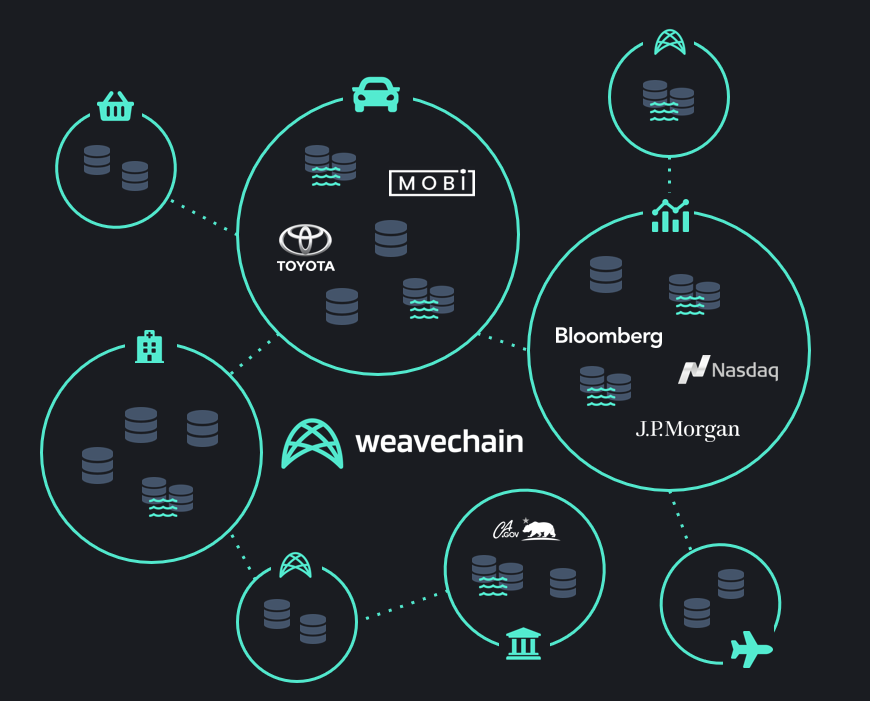
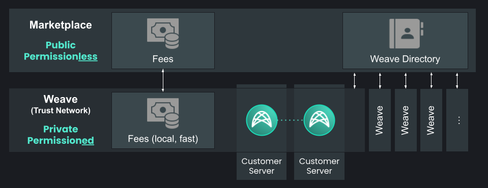
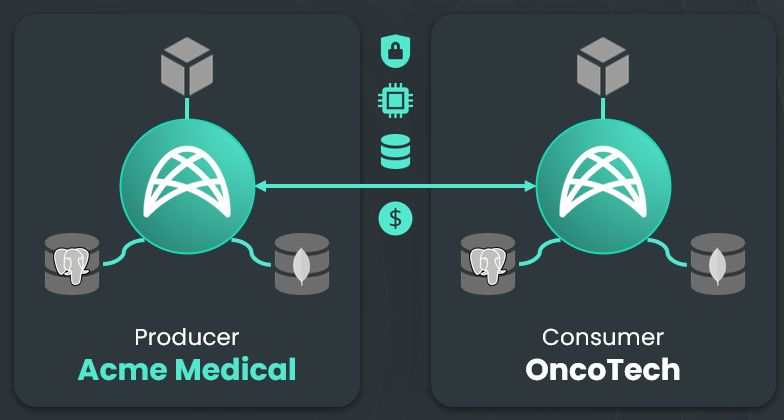
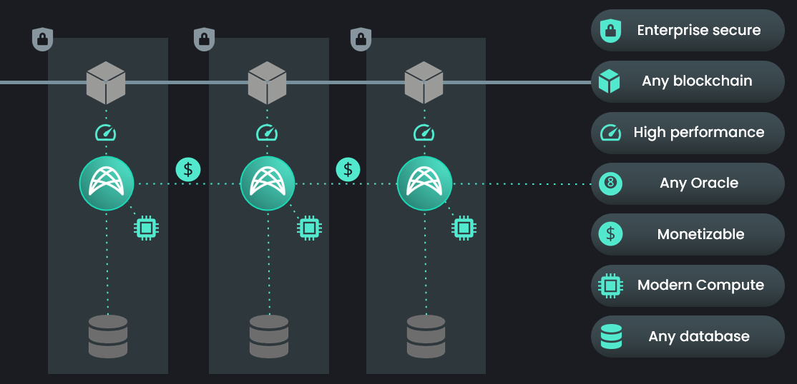
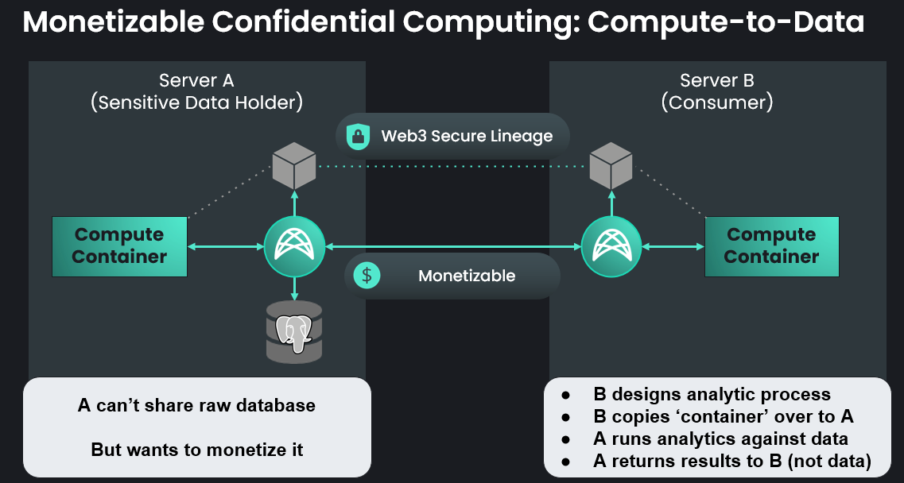
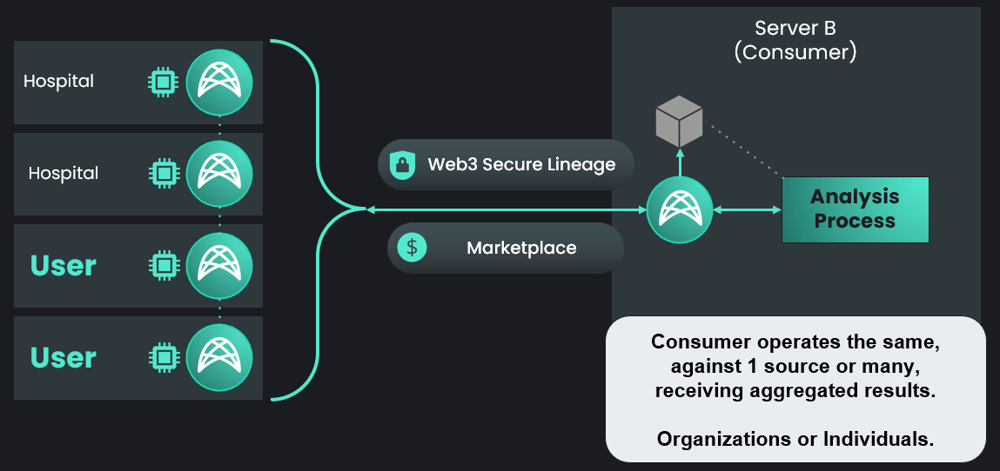

# Architecture

Weavechain's goal is to become the decentralized network of permissioned networks that brings private data to Web3.

Islands of data where people or organizations have full control of what they share, who they share data with and how, are connected through a marketplace layer that sits on top of all those permissioned networks and acts as a directory, routing and settlement layer.

There are two main components in Weavechain's design:

- **Weaves**: The data meshes that are in charge of sharing the data
- **Marketplace**: A layer on which Weaves can advertise their existence

## <a name="Weaves">Weaves</a>

Weaves are a distributed network of nodes that sit on top of existing databases, be it relational (such as Postgres, MySql, MSSQL, Oracle, Aurora), time series oriented (sample InfluxDB, GridDB), document stores (MongoDB, RethinkDB), embedded (SQLite, LevelDB, RocksDB) or file storage systems (local, S3 or IPFS).

Their role is to:

- Intermediate the data storage and potentially replicate the data.
- Gate data access, using role-based access control and various authentication methods
- Maintain immutability proofs, like a hash of the data that can be stored in a blockchain. These blockchains can be public like Ethereum, or private with nodes running in a restricted trust network.
- Generate proofs for data.
- Enable confidential computing features.
- Keep a full audit log for changes and access, and offer a lineage for both data and computations.
- Act as a Web3 data source, both for direct access or publishing to blockchains as Oracle middleware.
- Issue verifiable credentials.
- Monetize data directly or via a marketplace.

Weave configurations are currently controlled by the single superadmin account that creates them. We are building functionality that would enable a consortia to vote on configurations in a DAO-like fashion, supporting weighted votes and delegation.

Weaves can be comprised of any number of nodes and the participants can be both data producers and data consumers. Additionally, API consumers can interact directly without running nodes as long as they have a registered account with the Weave.

#### <a name="Nodes">Nodes</a>

Nodes are a collection of services that can run either as a docker image or as a standalone java process. 

A node is part of a single Weave and can be configured to have active connections to other nodes.

At least one *bootstrap node* needs to be publicly available on the internet if the Weave intends to be able to store or publish data from consumers that are not in the local network or having a VPN connection.

Depending on their availability, the nodes could be categorized as

- Active Nodes: Other peers can connect to them directly.
- Passive Nodes: These run on machines behind a router, which can connect to an active node, but to which new connections cannot be established from outside.
- Proxied Nodes: These can’t be reached directly, they’re advertised to peers by nodes that know about their existence.

When replication or multi-party compute tasks require direct message exchanges between nodes, active nodes can forward encrypted messages to passive/proxy nodes.

Nodes can be configured to support various protocols. The default is to run the node infrastructure over Websockets and allow API connections via HTTP(S) and Websockets. Nodes can be configured to also allow incoming Kafka, RabbitMQ or ZeroMQ connections. Each transport layer has its own advantages and disadvantages. 

In addition to the encryption in transit using secure channels, AES-256 encryption can be enabled, allowing the nodes or API clients to operate over plain HTTP.

Nodes can replicate both user data and Weave configurations (including RBAC tables). 
All activity is signed in order to prevent malicious writers.

#### <a name="Authentication">Authentication</a>

In order to get access to a Weave, an API connection must be established with any node of the Weave.

The login is achieved with a private/public key pair, where the public key has been pre-authorized by the Weave. Alternatively users can login or get access to data using pre-authorized Verifiable Credentials, proving blockchain accounts ownership, using NFTs, ZK Proofs or Smart Contracts.

When using Verifiable Credentials, the Weave can be configured to allow reusable credentials or require one-time presentations that specify the public key that should inherit the access rights of the credentials presented.

When using Blockchain accounts, a personal signature is added during the login process as proof of the wallet ownership, and the rights are configured by wallet address in the nodes.

When using NFTs, the wallet ownership is checked, then the NFT ownership is verified on a configured blockchain. NFTs can be used to unlock data up to table level granularity.

When using Zero-Knowledge Proofs, the user can obtain access to a node without previously being authorized, by proving they know a piece of information that the node also has for the user.

When using Email Magic Links, the user receives a token via e-mail, which then can be used to enable an existing session to gain rights associated with that email address or its domain.

User access conditions can be enhanced with checks of smart contract states on any of the supported blockchains.

After login, a session is created, identified by an API key that can be used to track all the actions triggered by operations made in that session. 

These sessions also ensure the integrity of the request-reply flow and have a nonce, a secret shared with the server that must be used to sign operations and an expiration time after which the tokens need to be renewed.

A node can be configured such that any of the methods above can be used to gain access to APIs, to compute resources, or to data with access controlled up to row-level.

#### <a name="Audit">Audit</a>

All operations done within a Weave are fully audited. This applies not just to the write operations, but also to reads, compute tasks and everything else. This enables detailed tracking of how data flows within the system.

The audit records can be stored in the same network or can be stored in a remote Weave to enhance security.

As long as data processing happens within the system and there is no exfiltration to a Web2 system, usage rules can be enforced as well as monetization.

For example, compute tasks that are executed within the system can offer computational lineage guarantees, meaning that nodes can vouch that a certain output is produced by a certain input and compute task. Hashes are created of the input data, the compute task, the output data, and these hashes are cryptographically signed by the node that performed the computation.

When data is shared across multiple nodes, this can be extended to a consensus, i.e. the same task is run by multiple nodes that vouch for the integrity of the input data and agree on the output, providing the consumer a set of signatures certifying the result by the trust network. This proof can be taken outside of the ecosystem by attaching checksums and signatures to output files or going as far as signing generated PDFs.

#### <a name="Storage">Storage</a>

A Weave node can sit on top of one or many databases or file storage systems of different types, what we'll call Data Collections.

Each Data Collection can be:

- Replicated, a case where other nodes in the Weave make copies of the Data Collection,
- Non-Replicated, where other nodes don't make copies of the Data Collection. Data integrity guarantees can still be offered in this case by maintaining the data hashes, as well as the other features that Weavechain offers.

A node can be in charge of all of the operations with the database when every write operation happens using the Weavechain API. Alternatively, nodes can implement a listener pattern, sitting on top of a database that is updated by external actors.

Depending on the configuration, nodes can offer different guarantees for the data and for the audit trail. For example, in a listener pattern no audit trail can be offered prior to the moment when first reading the data.

The underlying storage can have encryption at rest capabilities. On top of that, stored data can be encrypted with a secret configured per data collection, known to the node. This encryption can be turned on/off at field level.

The storage setup that offers the maximum guarantees and lineage trail is using append-only databases. Mutable tables can be transformed into append only time series in order to be able to offer lineage. Additionally, records deleted can be marked using tombstones, and occasional swipes or history collapsing to a snapshot can achieve the true data forgetting needed for GDPR.

Each use case will have specific requirements. Weaves are designed to be flexible and support various scenarios, offering different and specific guarantees.

Access to data collections is controlled by RBAC. Rights can be configured at the table level, including Read, Write, Compute, Create, Drop and View (that the table exists).

In order to allow PII obfuscation, table columns can be assigned data transformations that are applied on read, such as:

- Erasure
- Redaction (with custom values depending on input)
- Hashing
- Unique Random IDs (consistent within tables)
- Linked Random IDs (consistent across tables)
- Quantization, Scaling and non-linear transformations
- Noise Addition
- Encryption (at read time)

If the privacy concerns are higher, databases can be configured to allow local access only. This means that the data cannot be read remotely by consumers, only confidential computing tasks can be enabled on top of it.

Integrity checks and storage proofs can be triggered on demand or scheduled periodically, either for checking entire tables content or by doing random sampling.

#### <a name="Operations">Operations</a>

The main operations on data that are supported by a Weave are:

- Read, which can include a data verification step (either by querying the blockchain and matching actual data hashes to stored hashes or via network consensus),
- Write, which can include replication and storing hashes for later integrity guarantees,
- Compute, including 3 patterns of confidential compute and building proofs on data

In addition to those, there are additional API functions to offer the building blocks for Web3 ready apps, including verifiable credentials, lineage and messaging.

For more details about all the operation supported check the [API](./api.md)

#### <a name="Monetization">Monetization</a>

Monetization is possible for all the 3 types of operations above (read, write, compute), and can be configured by each Weave independently according to their needs.

In addition to node operations monetization, any custom server can be launched as an inner feed handled by the node and API calls to it be monetized instantly without any change of the underlying service and just adding a header to the callers. This is achieved by proxying the API calls through the node and generating an JWT authorization token that can be used to link the caller to a Weavechain public key. In addition to monetization, this approach can also be used to seamlessly add a RBAC on top of any API, gate existing APIs with NFTs ownership proofs, verifiable credentials etc.

The party performing the action (reading, writing, performing compute, API calls) can be configured to pay or be paid for their activity as desired.

Fee schedules can be configured per record, per size, per unit of time (such as daily) for data, capped or not, and for CPU usage or unit of time for compute.

Payments can be done in USDC or a custom ERC-20 token. Micropayments are recorded locally in a ledger in the weave network and synchronized periodically to a blockchain. For details on payment synchronization, see [Token Bridging](#Token_Bridging).

#### <a name="Batching">Batching</a>

In order to support higher volumes at write, batching can be configured in the API both on the client side as well as on the node side.

The batches can be determined using multiple criteria, such as:

- Record count
- Record size 
- Maximum throttling wait time

When batching is done at the server side, the batches that arrive from clients are kept intact to preserve the integrity guarantees created by client signatures.

#### <a name="Signing">Signing</a>

Signing happens at multiple levels, both when delivering data and when delivering computational results.

Higher integrity guarantees can be configured by a node, adding signature requirements from API clients. Each piece of data that is written by an API client is hashed and can be signed with the writer's private key.

Each node that receives and needs to replicate the data can verify the authenticity by reproducing the hash from the raw data and checking the signature of the original writer.

When a node is running a compute task, the inputs and the outputs can be hashed and signed with the node's private key, as a guarantee of the result authenticity. Or a number of such signatures can be obtained by running a consensus compute as a guarantee of reproducibility. These hashes and signatures can be configured to be automatically put on a smart contract or an NFT can be minted to the caller, proving that a certain task with a given set of inputs was verified to produce a certain result.

By default Ed25519 is used for signing, and nodes be configured to use Dilithium in order to produce quantum-resistant signatures.

#### <a name="Hashing">Hashing</a>

Hashes of the data establish data integrity guarantees. Storing hashes in public blockchains such as Ethereum provides a stronger integrity proof, but has the downside of being public and expensive. Storing hashes on private blockchains such as Hyperledger Sawtooth is inexpensive, but increases the risk of tampering if the trust network is small.

In order to prevent dictionary attacks, data hashes are computed using a secret salt that is known only to authorized Weave members.

The hashing function can be configured and can range from HMAC or salted SHA-256, SHA-512, Keccak-256 or Keccak-512, Blake2 or, if needed, post-quantum hash-based signature schemes like MT XMSS or SHA-512 with SPHINCS256. By default hashing is done using HmacSHA256.

Hashes can be configured to be computed and stored for each record or for batches of records. When using batching, the ability to hash large datasets is feasible, but there is a downside at verify time, as an entire batch needs to be checked in order to ascertain the validity of a record at read time. Tuning the batching configuration is needed depending on the use case.

Hashes are stored on the blockchain either during an initial hashing of the database to which a node was attached, or when write operations are triggered via the API. 

The node that is orchestrating replication gathers a threshold signature from all of the other nodes that are part of the trust network. The signature is checked by a smart contract on the blockchain when calling the hash storage function to verify that there was consensus at write time. This ensures that the leader is not writing a malicious hash value. The alternative is to call the chain from every node, which can be more costly in time or gas.

#### <a name="Replication_Integrity_Guarantees">Replication Integrity Guarantees</a>

Data integrity is established by hashes stored on a blockchain (see [Hahing](#Hashing)), and by data replicas that can be stored by nodes running on trusted parties machines. When using the API to write data, there is an additional hashing and signing done client side, allowing nodes that participate in the replication process to verify that the data is matching what the originator sent (see [Anatomy of a Write Operation](#Write)).

In addition to data hashes, storage proofs can be generated by nodes for whole datasets or for filtered rows only. A challenge is sent by a node that has a replica of the data, the receiver computes a hash that includes the challenge and returns it to the challenger. If the node that requested the proof can validate the reply by hashing the data with the same challenge.

Taking this a step further, interactive zk storage proofs can be used to avoid leaking information to nodes that pretend to have the data: it is similar to a challenge storage proof, just that the instead of returning a hash, only a proof of knowing the hash is returned, making sure that a dictionary attack is not possible by some node that does not have the data replicated, even if it's an authorized member of the Weave and knows the secret salt used during hashing.

Non-interactive zk proofs of storage are not feasible, both due to computation time and proof size. However, we offer the feature of proving knowledge of a hash pre-image which can be used for small datasets.

#### <a name="Compute">Compute</a>

Compute operations are fully audited, monetizable, and can offer lineage guarantees. Compute outputs can be traced to the source inputs and the task that generated them, as well as verified by 3rd parties that know the public key of the node that did the computation.

Compute consensus can happen on top of this, having multiple parties running the same task on their own copy of the data and vouching via signatures for a common reply.

Task lineage graphs can be built out of the audit trail, as long as all the processing is happening within the system.

Compute tasks can be triggered in the node to which the API is connected, in a list of target nodes or in all active nodes (if authorized).

The outputs of a compute to data task can have several forms:

- An output that is returned to the user, be it in text format or encoded binary. We also offer helper functions to output signed PDFs.
- The task logs, when using compute to data, which can be filtered or not depending on configurations.
- Data records, when a compute to data task is doing some processing and writing results to an output table. 

In all forms, activity can be proven. For computation, the output can be signed by the executing node, proving that the result came from a certain set of input data and a certain compute task. When data is written, there is also an audit trail and lineage information that can be generated.

In order to prevent unwanted data leakage, outputs can be filtered based on few rules:

- Maximum output size,
- Reject output in case of keywords presence,
- Output must follow a fixed template,
- Limit the data on which the operations can be done (such as requiring at least a number of records or a number of parties to participate in an aggregation task)

There are 3 patterns of confidential computing that Weaves support, each having its own strengths and limitations and which can be used alone or mixed, depending on the use case:

##### <a name="Compute_To_Data">1. Compute to data</a>

This feature allows running pre-approved **Docker** or **WebAssembly** images remotely on the data owner's infrastructure, allowing confidential computing without the risk of exposing the private data.

A local or remote docker instance or a kubernetes cluster can be used to launch images.

Compute to data can be done in a two party scenario or in a multi party scenario.

When having a multi-party scenario, the consumer is in charge of aggregating the individual responses. Compute tasks can also be run with a consensus flag, a case in which the same output is expected from all the nodes (and signatures are gathered as proof of consensus).

The advantage of using docker images is full flexibility for the tasks that can be run.

In this case the executed code is known to the data owner and should be audited. Weaves could be configured to automatically approve images to be run, but this has some risks for the data owner regarding both security and data exfiltration. The automatic filters that can be applied by nodes to prevent unwanted data leakage can always be circumvented using encryption or steganography if there is no audit of the code.

Depending on the analysis to be run, the task can be run either:
- By all of the target nodes in parallel, where an aggregation happens at the end of the operations,
- Sequentially, where there could be a state that is passed from one node to the other.

Federated Tensorflow will also be supported as a compute to data task.

##### <a name="MPC">2. Multi-party computing</a>

Weavechain supports MPC using the SPDZ protocol, integrating the Framework for Efficient and Secure Computation by [Alexandra Institute](https://github.com/aicis/fresco).

This is different compared to compute to data in several aspects:

- The functions supported are predefined, such as descriptive stats (like mean, median, stdev, variance), statistical tests (t-test), private set intersection and linear regression and run in the node process,
- Adding new functions requires adding them to the Weavechain codebase,
- There is no security risk for the owner of the data, as the code to be executed is fixed and known beforehand,
- MPC can become very slow, depending on the volume of data and the number of parties this can be suitable or not for the specific use case wanted.

When the final data aggregation can be done by the consumer and does not require any data exchange between parties, the same predefined functions can be executed in a series of 2 parties rounds, involving just the consumer and the producer nodes one by one. In this case the speed concerns do not exist.

##### <a name="HE">3. Two party homomorphic encryption</a>

Weave nodes can support compute tasks over encrypted data using the CKKS encryption scheme. 

Weavechain wraps [SEAL](https://github.com/microsoft/SEAL) and [EVA](https://github.com/microsoft/EVA) from Microsoft offering seamless access to homomorphic encryption features.

Data owners can configure specific columns to be available either encrypted or in plaintext. Consumers can run computations on the encrypted data, producing a set of encrypted results. These results are sent back to the owner, who can decide whether to release the aggregated results back to the consumer, using filtering rules as described previously.

Plaintext fields could be used for aggregation, and mixed with locally available information that is not shared with the other party. The advantage of this pattern is that the consumer task code and local information can remain secret, so that only the aggregated result is known by the data owner.

##### <a name="ZKP">Zero-knowledge proofs for data</a>

In addition to confidential computing patterns, zero-knowledge proofs (ZKPs) for data can be configured to be fully or partially available. 

Weave nodes can generate Bulletproofs, with multiple gadgets implemented such as validating number values or proving knowledge of a hash pre-image.

ZKPs can be used for generating useful outputs as well as debugging datasets without having access to them.

For example, a single ZKP could validate that all measurements in a table are greater than zero. Or a ZKP could be generated for each row, checking that some measurement value is in a reference interval, without revealing the actual value to the data consumer. 

Caveat, ZKPs can become slow and large, so this is not a feature suitable for any scenario.

#### <a name="Write">Anatomy of a Write Operation</a>

Let's consider a scenario where a data producer writes some data using the API.

At the producer level, the API can choose to batch the writes. Batching at the client makes sense when there are a lot of small and continuous writes.

Accumulated data is hashed and the hash is signed with the producer's private key.

The API sends a new batch of data to be written to the node to which it's connected.

If the node is not currently the leader orchestrating writing for the time series, it starts a consensus round to become the leader (PBFT) and obtain a Time Lease.

We use Time Leases of 2 seconds to be able to achieve full throughput writes in that time window. The time window can be adjusted, depending on the scenario. For example if there are few writers that take turns and many consumers, it makes sense to use larger windows of time lease. If instead there are many writers writing small pieces of data, the time window can be lowered or the consensus could be switched to be done at record level.

Different writers can connect to the same node to avoid competing leaders.

Data is ordered by the arrival time in the leader node and we use a network time that is adjusted dynamically (see [Network Time](#Network_Time)).

Once a node is allowed by the rest of the network to become a write leader, it checks that the data hash is matching the one from the source (EdDSA with the writer's public key)

The node starts the data replication and writes it to its local database in parallel. For the trivial case of non-replicated scopes only the write to the database happens.

Each node that receives the data checks it to make sure that its hash matches the one signed by the producer and proceeds with storing it to its local database.

The nodes can optionally add the public key of the writer, the network time or the integrity signatures from the client to the data stored in the target time series, to have it readily available (these can always be recovered from audit records with a more costly operation). This step is eventually hydrating the client data and after that a new hash is generated by the nodes using a secret salt known only to the nodes.

Once a node "promises" to store the data, it signs with its own private key the hash of the data and sends it back to the leader node.

Depending on the write options, if it must be a guaranteed write, a node can answer once the data is flushed in the database or file storage or immediately after it has the data in memory (i.e. before the DB write)

The leader node accumulates the replies which contain signatures from the other nodes that did the replication in order to pass them back to the original writer. The client can then check the validity of the signatures with the nodes public keys (i.e. it does not have to trust the node to which it was connected with the API).

The leader node does another round of exchanges with the other nodes to build a threshold signature (T out of N) for the hash, where each node contributes with its secret share of a private key. This is used to issue a single call to a blockchain to store the hash while still making sure that there is a network consensus that the hash is the right one. The alternative would have been to have each node that persists the data interact with the smart contract (and do the check the consensus there), which could be both slower and significantly more expensive when having paid operations.

The leader node executes the smart contract call containing the threshold signature, storing the hash of the data and some metadata (ex. the batch IDs range), and the smart contract checks the signature and eventually stores the hash in the contract state.

Contract state sharding is done for certain blockchains when the state gets too big.

Contract state serialization and deserialization can introduce performance hits, this being the reason why there is an option to store the hashes on a Weavechain Layer-1. Weavechain's Layer-1 was designed to be a blockchain replacement running in the same process that keeps an in-memory LRU cache of the hashes.

The hash includes a secret salt component that is known only to Weave members. This prevents dictionary attacks when the hash is stored on a public blockchain.

After the hash is written on the blockchain, the staged data becomes permanent and has immutability guarantees.

The hash is not the data; if the storage disappears, the hash is not enough to reconstruct the data. However, it can be used to check the integrity, be it on demand or periodically.

If replication is enabled, a consensus can be done on the trust network that replicated the data and restore the missing or altered data.

#### <a name="Read">Anatomy of a Read Operation</a>

When a consumer issues a read from the API, the access control rules are checked to ensure both that the user is permissioned, and that the Data Collection allows remote reading.

Records are read from the data that is attached to the node to which the API consumer is connected and returned to the user.

A read operation can have various filters on the target table fields. The order of returned results can be specified, the output of the query can be limited, and fields can be collapsed.

Before the data is returned to the user, a PII transformation layer can obfuscate certain fields that are not supposed to be public, erasing them or replacing them with a hash or a unique random (per value) ID.

By default, read operations are configured to check the hashes of the data to check integrity. This means that the node looks at the hashes of the queried data from the blockchain and checks them against the actual data returned to the user.

If the node is trusted or the integrity was previously checked by other means (such as the storage proofs API calls), this check can be skipped at read operation level to optimize for speed.

If the API client has access to the blockchain and does not want to delegate the trust for the hash check to the node to which the API is connected, the data can be checked by the consumer itself.

A read operation can also be configured to query all active nodes from the Weave network or specific nodes specified via their public key and do a consensus read of the data. In this case the node to which the API read is issued becomes a leader in charge of orchestrating the forwarding of the call and building the reply. The operation will be successful if all nodes return the same data.

Another type of read operation involving multiple nodes is a multiplexing read. When nodes have private non-replicated data, a read can be triggered to gather the records from multiple nodes and mux them together before generating the reply. In this case the data is expected to be different in each node, unlike in a consensus read. The source node information is added as a new column in the returned dataset.

#### <a name="Network_Time">Network Time</a>

A network time is maintained by each of the nodes, and the ordering of the operations in a Weave is done by the time of arrival of the request at the node that is in charge of orchestrating the operation.

Each node pings all the other nodes to which it is connected and receives a reply with the clock on the other machines.

The difference between the clocks and half the roundtrip time is taken, and the median of this measure over a recent window of time is computed for each known neighbor. The median of these adjustments is applied to the local clock to compute a network time.

#### <a name="Token_Bridging">Token Bridging</a>

When using EVM compatible blockchains as the settlement layer, a smart contract is deployed on that blockchain by each Weave.

ERC-20 tokens can be locked in that smart contract, funding weave accounts identified by their public keys.

The funds can be in two states in the smart contract: withdrawable or locked. When locked, they are bridged in the Weave accounts ledger.

Once bridged, these funds can be used to pay for data or compute.

Funds are periodically synchronized to the main blockchain smart contract. Local payments are secure, and synchronization can be done rarely to avoid gas fees.

Withdrawing funds can be done only from within the Weave, with both the user and a nodes consensus signing the transaction using a threshold signature. The action consists of moving funds that are available in the Weave from a locked state to a withdrawable state.

The operation above will withdraw tokens from the Weave and make them available in the smart contract on the main blockchain. Users can then withdraw them from that smart contract to their wallets.

## <a name="Marketplace">Marketplace</a>

The marketplace is currently implemented as smart contracts that can be hosted on EVM compatible blockchains.

Its role is to:

- Act as a directory where weaves can advertise their presence and/or their datasets
- Act as a settlement layer where the wallets of the participants in the private data exchanges are located
- Act as a standardization layer, where data formats can be established (and voted)

Note, this feature is still in development. Our early customers are still operating in an intra-weave capacity, and are functional without the Marketplace.