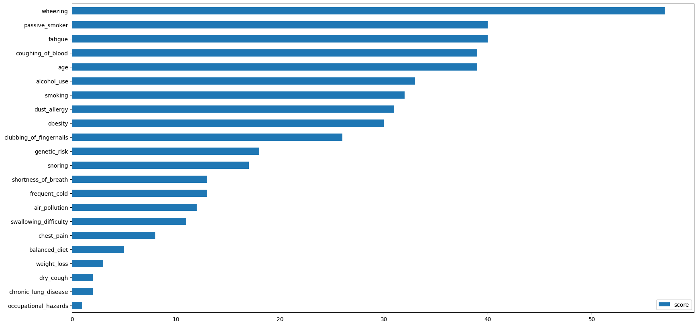

## Connecting a local database

### Install docker images

- Install a Weavechain node locally if not done already, the easiest way is by starting it as a [docker](./docker.md)
- Install a local jupyter [jupyter server](./jupyter.md) to connect to the node (if not done already)
- Allow running local docker images by running 
```sh
  docker run -d -v /var/run/docker.sock:/var/run/docker.sock -p 0.0.0.0:2375:2375 bobrik/socat TCP-LISTEN:2375,fork UNIX-CONNECT:/var/run/docker.sock
```

### Prepare the data

- go to the folder where the node was installed, download the [sample.csv](https://public.weavechain.com/file/sample.csv) and save it under storage/files/private_files (create the private_files folder if missing), or do it from command line once in the weavechain node folder
```sh
  mkdir -p storage/files/private_files
  cd storage/files/private_files
  curl -O https://public.weavechain.com/file/sample.csv  
```

### Run the notebook

- make sure both the node and jupyter server dockers are running
- connect to the local jupyter server [http://127.0.0.1:18888/notebooks/sample-compute.ipynb](http://127.0.0.1:18888/notebooks/sample-compute.ipynb)
- use the token taken from the weave_jupyter_public docker logs
- OR, if you're not using the provided docker server, download the notebook from [here](https://public.weavechain.com/file/sample-compute.ipynb) and run it in your locally configured jupyter server
- run the cells one by one, in case of errors check for the docker images running properly and without errors in their logs and for the ports being open
- contact us on [Telegram](https://t.me/weavechain_support) or via email [support@weavechain.com](mailto:support@weavechain.com)
- see below a non-interactive output of how the notebook should look like

## Sample of expected notebook:
---
In this demo notebook we will showcase running a compute to data:

- we will create a table in a private data collection that cannot be accessed remotely
- we'll populate it with data
- run a compute to data task to train a model without having access to the data
- verify the task lineage
- generate a ZK proof for the data
   
The default Weavechain node installation is preconfigured to support this scenario (by connecting to a public weave, having a *private* data collection defined and mapped to a in-process SQLite instance and read rights for that collection already given).

### 1. Create an API session


```python
import pandas as pd

from weaveapi.records import *
from weaveapi.options import *
from weaveapi.filter import *
from weaveapi.weaveh import *

WEAVE_CONFIG = "config/demo_client_local.config"
nodeApi, session = connect_weave_api(WEAVE_CONFIG)
```

    {"res":"ok","data":"pong 1674717913804"}


### 2. Read data from the prepared file

- go to the folder where the local node was installed
- download [sample.csv](https://public.weavechain.com/file/sample.csv) and place it under storage/file/private_files folder
- theoretically we could have used the file from the jupyter server, using this step to show how to connect a local storage to the node
- the *private_files* storage is already configured in the node at install time, the following config section marking it as non-replicated and as storing raw files (many formats are supported, from CSV to feather or ORC, for those each file being treated as a table)
```
  'private_files': {
     'connectionAdapterType': 'file',
     'replication': {
       'type': 'none',
      },
      'fileConfig': {
        'rootFolder': 'weavestorage/files',
        'format': 'file'
      }
  }
```


```python
file_storage = "private_files"
file = "sample.csv"

import csv, base64
from io import StringIO
reply = nodeApi.downloadTable(session, file_storage, file, None, "file", READ_DEFAULT_NO_CHAIN).get()
data = base64.b64decode(reply["data"]).decode("utf-8-sig")

df = pd.read_csv(StringIO(data), sep=",")
display(df.head())
```


<div>
<style scoped>
    .dataframe tbody tr th:only-of-type {
        vertical-align: middle;
    }

    .dataframe tbody tr th {
        vertical-align: top;
    }

    .dataframe thead th {
        text-align: right;
    }
</style>
<table border="1" class="dataframe">
  <thead>
    <tr style="text-align: right;">
      <th></th>
      <th>id</th>
      <th>name</th>
      <th>age</th>
      <th>gender</th>
      <th>air_pollution</th>
      <th>alcohol_use</th>
      <th>dust_allergy</th>
      <th>occupational_hazards</th>
      <th>genetic_risk</th>
      <th>chronic_lung_disease</th>
      <th>...</th>
      <th>fatigue</th>
      <th>weight_loss</th>
      <th>shortness_of_breath</th>
      <th>wheezing</th>
      <th>swallowing_difficulty</th>
      <th>clubbing_of_fingernails</th>
      <th>frequent_cold</th>
      <th>dry_cough</th>
      <th>snoring</th>
      <th>level</th>
    </tr>
  </thead>
  <tbody>
    <tr>
      <th>0</th>
      <td>1</td>
      <td>Lorenzo Rasmussen</td>
      <td>33</td>
      <td>1</td>
      <td>2</td>
      <td>4</td>
      <td>5</td>
      <td>4</td>
      <td>3</td>
      <td>2</td>
      <td>...</td>
      <td>3</td>
      <td>4</td>
      <td>2</td>
      <td>2</td>
      <td>3</td>
      <td>1</td>
      <td>2</td>
      <td>3</td>
      <td>4</td>
      <td>1</td>
    </tr>
    <tr>
      <th>1</th>
      <td>2</td>
      <td>Zechariah Gallegos</td>
      <td>17</td>
      <td>1</td>
      <td>3</td>
      <td>1</td>
      <td>5</td>
      <td>3</td>
      <td>4</td>
      <td>2</td>
      <td>...</td>
      <td>1</td>
      <td>3</td>
      <td>7</td>
      <td>8</td>
      <td>6</td>
      <td>2</td>
      <td>1</td>
      <td>7</td>
      <td>2</td>
      <td>2</td>
    </tr>
    <tr>
      <th>2</th>
      <td>3</td>
      <td>Lukas Jenkins</td>
      <td>35</td>
      <td>1</td>
      <td>4</td>
      <td>5</td>
      <td>6</td>
      <td>5</td>
      <td>5</td>
      <td>4</td>
      <td>...</td>
      <td>8</td>
      <td>7</td>
      <td>9</td>
      <td>2</td>
      <td>1</td>
      <td>4</td>
      <td>6</td>
      <td>7</td>
      <td>2</td>
      <td>3</td>
    </tr>
    <tr>
      <th>3</th>
      <td>4</td>
      <td>Trey Holden</td>
      <td>37</td>
      <td>1</td>
      <td>7</td>
      <td>7</td>
      <td>7</td>
      <td>7</td>
      <td>6</td>
      <td>7</td>
      <td>...</td>
      <td>4</td>
      <td>2</td>
      <td>3</td>
      <td>1</td>
      <td>4</td>
      <td>5</td>
      <td>6</td>
      <td>7</td>
      <td>5</td>
      <td>3</td>
    </tr>
    <tr>
      <th>4</th>
      <td>5</td>
      <td>Branson Rivera</td>
      <td>46</td>
      <td>1</td>
      <td>6</td>
      <td>8</td>
      <td>7</td>
      <td>7</td>
      <td>7</td>
      <td>6</td>
      <td>...</td>
      <td>3</td>
      <td>2</td>
      <td>4</td>
      <td>1</td>
      <td>4</td>
      <td>2</td>
      <td>4</td>
      <td>2</td>
      <td>3</td>
      <td>3</td>
    </tr>
  </tbody>
</table>
<p>5 rows × 26 columns</p>
</div>


### 2. Create a local table private table starting from the file

- we drop the existing table if already existing and re-create it from scratch
- a weavechain node can also connect to existing tables, reading their structure, but in this case we create it via the API
- we create the table in a pre-configured data collection that will be not replicated and stored in a local SQLite
```
  'private_files': {
     'connectionAdapterType': 'sqlite',
     'replication': {
       'type': 'none',
      },
      'jdbcConfig': {
        'database': 'weavestorage/storage_private.db'
      }
  }
```


```python
data_collection = "private"
table = "oncology_data"

columns = {}
for c in df.columns:
    if c == "id":
        coldef = { "type": "LONG", "isIndexed": True, "isUnique": True, "isNullable": False }
    elif c == "name":
        coldef = { "type": "STRING", "readTransform": "ERASURE" }
    else:
        coldef = { "type": "DOUBLE" }
    columns[c] = coldef

layout = { 
    "columns": columns, 
    "idColumnIndex": 0, 
    "isLocal": False,
    "applyReadTransformations": True
}
#print(layout)

nodeApi.dropTable(session, data_collection, table).get()
reply = nodeApi.createTable(session, data_collection, table, CreateOptions(False, False, layout)).get()
print(reply)

records = Records(table, df.to_numpy().tolist())
reply = nodeApi.write(session, data_collection, records, WRITE_DEFAULT).get()
print(reply)
```

    {'res': 'ok', 'target': {'operationType': 'CREATE_TABLE', 'organization': 'weavedemo', 'account': 'weaveyh5R1ytoUCZnr3JjqMDfhUrXwqWC2EWnZX3q7krKLPcg', 'scope': 'private', 'table': 'oncology_data'}}
    {'res': 'ok', 'target': {'operationType': 'WRITE', 'organization': 'weavedemo', 'account': 'weaveyh5R1ytoUCZnr3JjqMDfhUrXwqWC2EWnZX3q7krKLPcg', 'scope': 'private', 'table': 'oncology_data'}, 'data': 'weaveyh5R1ytoUCZnr3JjqMDfhUrXwqWC2EWnZX3q7krKLPcg,4RKj6WTnS2AQrLXz04Sr2UnBxcS7dn0am5ymb2KiHDs=,3pHcKrG2afiuoMQ6x6w8GaArkn5TjjfwCcwiCqWotW1kUKMPh4kAv32yBmU8Lr85dcYcv1g68TexDb4riPMZAyQB'}


```python
reply = nodeApi.read(session, data_collection, table, None, READ_DEFAULT_NO_CHAIN).get()
#print(reply)
df = pd.DataFrame(reply["data"])

df.head()
```


<div>
<style scoped>
    .dataframe tbody tr th:only-of-type {
        vertical-align: middle;
    }

    .dataframe tbody tr th {
        vertical-align: top;
    }

    .dataframe thead th {
        text-align: right;
    }
</style>
<table border="1" class="dataframe">
  <thead>
    <tr style="text-align: right;">
      <th></th>
      <th>id</th>
      <th>name</th>
      <th>age</th>
      <th>gender</th>
      <th>air_pollution</th>
      <th>alcohol_use</th>
      <th>dust_allergy</th>
      <th>occupational_hazards</th>
      <th>genetic_risk</th>
      <th>chronic_lung_disease</th>
      <th>...</th>
      <th>fatigue</th>
      <th>weight_loss</th>
      <th>shortness_of_breath</th>
      <th>wheezing</th>
      <th>swallowing_difficulty</th>
      <th>clubbing_of_fingernails</th>
      <th>frequent_cold</th>
      <th>dry_cough</th>
      <th>snoring</th>
      <th>level</th>
    </tr>
  </thead>
  <tbody>
    <tr>
      <th>0</th>
      <td>1</td>
      <td>Lorenzo Rasmussen</td>
      <td>33</td>
      <td>1</td>
      <td>2</td>
      <td>4</td>
      <td>5</td>
      <td>4</td>
      <td>3</td>
      <td>2</td>
      <td>...</td>
      <td>3</td>
      <td>4</td>
      <td>2</td>
      <td>2</td>
      <td>3</td>
      <td>1</td>
      <td>2</td>
      <td>3</td>
      <td>4</td>
      <td>1</td>
    </tr>
    <tr>
      <th>1</th>
      <td>2</td>
      <td>Zechariah Gallegos</td>
      <td>17</td>
      <td>1</td>
      <td>3</td>
      <td>1</td>
      <td>5</td>
      <td>3</td>
      <td>4</td>
      <td>2</td>
      <td>...</td>
      <td>1</td>
      <td>3</td>
      <td>7</td>
      <td>8</td>
      <td>6</td>
      <td>2</td>
      <td>1</td>
      <td>7</td>
      <td>2</td>
      <td>2</td>
    </tr>
    <tr>
      <th>2</th>
      <td>3</td>
      <td>Lukas Jenkins</td>
      <td>35</td>
      <td>1</td>
      <td>4</td>
      <td>5</td>
      <td>6</td>
      <td>5</td>
      <td>5</td>
      <td>4</td>
      <td>...</td>
      <td>8</td>
      <td>7</td>
      <td>9</td>
      <td>2</td>
      <td>1</td>
      <td>4</td>
      <td>6</td>
      <td>7</td>
      <td>2</td>
      <td>3</td>
    </tr>
    <tr>
      <th>3</th>
      <td>4</td>
      <td>Trey Holden</td>
      <td>37</td>
      <td>1</td>
      <td>7</td>
      <td>7</td>
      <td>7</td>
      <td>7</td>
      <td>6</td>
      <td>7</td>
      <td>...</td>
      <td>4</td>
      <td>2</td>
      <td>3</td>
      <td>1</td>
      <td>4</td>
      <td>5</td>
      <td>6</td>
      <td>7</td>
      <td>5</td>
      <td>3</td>
    </tr>
    <tr>
      <th>4</th>
      <td>5</td>
      <td>Branson Rivera</td>
      <td>46</td>
      <td>1</td>
      <td>6</td>
      <td>8</td>
      <td>7</td>
      <td>7</td>
      <td>7</td>
      <td>6</td>
      <td>...</td>
      <td>3</td>
      <td>2</td>
      <td>4</td>
      <td>1</td>
      <td>4</td>
      <td>2</td>
      <td>4</td>
      <td>2</td>
      <td>3</td>
      <td>3</td>
    </tr>
  </tbody>
</table>
<p>5 rows × 26 columns</p>
</div>


### 3. Mark the table private


```python
layout["isLocal"] = True
nodeApi.updateLayout(session, data_collection, table, json.dumps({ "layout": layout})).get()
```


    {'res': 'ok',
     'target': {'operationType': 'UPDATE_LAYOUT',
      'organization': 'weavedemo',
      'account': 'weaveyh5R1ytoUCZnr3JjqMDfhUrXwqWC2EWnZX3q7krKLPcg',
      'scope': 'private',
      'table': 'oncology_data'}}


and data cannot be read any longer except from the local node (we expect a **Not authorized** reply here)


```python
reply = nodeApi.read(session, data_collection, table, None, READ_DEFAULT_NO_CHAIN).get()
print(reply)
```

    {'res': 'err', 'target': {'operationType': 'READ', 'organization': 'weavedemo', 'account': 'weaveyh5R1ytoUCZnr3JjqMDfhUrXwqWC2EWnZX3q7krKLPcg', 'scope': 'private', 'table': 'oncology_data'}, 'message': 'Not authorized'}


### 4. Train an ML model on the private data

- run on the node machine
```
  docker pull gcr.io/weavechain/oncology_xgboost:latest
```
- use latest-arm64 if your machine is ARM
- the data owner needs to purposely enable running a certain image
- the node needs to be able to connect to the local docker instance
- in the default configuration file installed with the node, the sample script is pre-authorized with the following line
```
  'allowedImages': [ 'gcr.io/weavechain/oncology_xgboost' ]
```
- in case of error, uncomment the #print(reply) below to see details
- (compute to data is just one of the patterns of confidential computing supported, MPC and Homomorphic Encryption could also be used)


```python
reply = nodeApi.compute(session, "gcr.io/weavechain/oncology_xgboost", COMPUTE_DEFAULT).get()
#print(reply)
output = reply["data"]["output"]
print(output[:1200] + "...")
output = json.loads(output)
```

    {"model": "YmluZgAAAD8XAAAAAwAAAAEAAAAAAAAAAQAAAAcAAAABAAAAAQAAAAAAAAAAAAAAAAAAAAAAAAAAAAAAAAAAAAAAAAAAAAAAAAAAAAAAAAAAAAAAAAAAAAAAAAAAAAAAAAAAAAAAAAAAAAAAAAAAAAAAAAAAAAAAAAAAAAAAAAAAAAAAAAAAAAAAAAAOAAAAAAAAAG11bHRpOnNvZnRwcm9iBgAAAAAAAABnYnRyZWUsAQAAAQAAAAAAAAAAAAAAAAAAAAAAAAAAAAAAAAAAAAAAAAAAAAAAAAAAAAAAAAAAAAAAAAAAAAAAAAAAAAAAAAAAAAAAAAAAAAAAAAAAAAAAAAAAAAAAAAAAAAAAAAAAAAAAAAAAAAAAAAAAAAAAAAAAAAAAAAAAAAAAAAAAAAAAAAAAAAAAAAAAAAAAAAAAAAAAAAAAAAAAAAAAAAAAAQAAAAsAAAAAAAAAAAAAABcAAAAAAAAAAAAAAAAAAAAAAAAAAAAAAAAAAAAAAAAAAAAAAAAAAAAAAAAAAAAAAAAAAAAAAAAAAAAAAAAAAAAAAAAAAAAAAAAAAAAAAAAAAAAAAAAAAAAAAAAAAAAAAAAAAAAAAAAAAAAAAAAAAAAAAAAAAAAAAAAAAAAAAAAAAAAAAP////8BAAAAAgAAAAIAAIAAAJBAAAAAgAMAAAAEAAAACgAAgAAAYEAAAAAABQAAAAYAAAAJAACAAADwQAEAAIAHAAAACAAAABYAAIAAAKBAAQAAAAkAAAAKAAAACQAAgAAAIEACAACA//////////8AAAAA1mVlvgIAAAD//////////wAAAADmFLw+AwAAgP//////////AAAAAEGE5D4DAAAA//////////8AAAAA5RlPvgQAAID//////////wAAAADkGc8+BAAAAP//////////AAAAAG0+Y779nEdD4zjeQ1p2i70AAAAASfgoQ3EcU0P6hyI/AAAAAGRhoUFUVWlDjUE0vwAAAADk9SNC4zgCQycHqz8AAAAAz+gWQhzHoUJlQ/6+AAAAAAAAAACN42RDMio/vwAAAAAAAAAA4ziOQBW8nD8AAAAAAAAAAKqq8kI2br4/AAAAAAAAAADjOA5BlJUsvwAAAAAAAAAA4zgOQZOVrD8AAAAAAAAAAP//j0KwXj2/AAAAAAEAAAAVAAAAAAAAA...


### 5. Check the variable importance in the trained model

- we can now use the model that was trained that is not seen by the researcher
- we need to install xgboost in order to do so, run the section below only once (ARM machines might xgboost encounter version mismatches)


```python
!pip install scikit-learn
!pip install xgboost
!pip install matplotlib
```


```python
import base64
from xgboost import XGBClassifier

f = open("model.serialization", "wb")
f.write(base64.b64decode(output["model"]))
f.close()

model = XGBClassifier()
model.load_model('model.serialization')
if output.get("features") is not None:
    model.get_booster().feature_names = output["features"]
#print(model)

vimp = model.get_booster().get_score(importance_type='weight')
#print(vimp)
keys = list(vimp.keys())
values = list(vimp.values())
data = pd.DataFrame(data=values, index=keys, columns=["score"]).sort_values(by = "score", ascending=False)
data.nlargest(30, columns="score").plot(kind='barh', figsize = (20, 10)).invert_yaxis()
```

    /usr/local/lib/python3.9/dist-packages/xgboost/sklearn.py:782: UserWarning: Loading a native XGBoost model with Scikit-Learn interface.
      warnings.warn("Loading a native XGBoost model with Scikit-Learn interface.")


    

    


### 6. Verify signature for the output model

- the signature is done on the hash of all input data, the hash of the docker image and the hash of the output
- these hashes could be put on a blockchain as a proof of the ML model lineage
- somebody with access to data can verify the input hashes
- if multiple people have access to the data (and the training is deterministic), the same hashes are expected to be signed by different nodes


```python
import base58
data = reply["data"]

signature = data["outputSignature"]
check = nodeApi.verifyLineageSignature(signature, data.get("inputHash"), data.get("computeHash"), data.get("paramsHash"), data["output"])

print("Signature:", data["outputSignature"])
print("Valid:", check)
print("\nInput Hash:", data["inputHash"])
print("Compute Hash:", data["computeHash"])
print("Output Hash:", data["outputHash"])
print("Output:", data["output"][:400] + "..." + data["output"][-400:])
```

    Signature: 2psqu7mwhn3KLy1Vzb9uSBh1QSNuka4aynk7m7VwXvdvDe5cAzXd3HP4NGtgWNV2pzToEsadGJNTpPwtxmNgcE3z
    Valid: True
    
    Input Hash: 6LfKoQQMqb8fYgA1PwBPKMhFaJ59Fn3DWw6qTRri4zjN
    Compute Hash: 3ia9p7Ayg6PBmFg9zUXVyrmUYbt4jz4YCUY3Cx7nXE1Q
    Output Hash: YWuSGd184YZhfDWw758gPJaEmsCNqe6rfGBkznbWuF5
    Output: {"model": "YmluZgAAAD8XAAAAAwAAAAEAAAAAAAAAAQAAAAcAAAABAAAAAQAAAAAAAAAAAAAAAAAAAAAAAAAAAAAAAAAAAAAAAAAAAAAAAAAAAAAAAAAAAAAAAAAAAAAAAAAAAAAAAAAAAAAAAAAAAAAAAAAAAAAAAAAAAAAAAAAAAAAAAAAAAAAAAAAAAAAAAAAOAAAAAAAAAG11bHRpOnNvZnRwcm9iBgAAAAAAAABnYnRyZWUsAQAAAQAAAAAAAAAAAAAAAAAAAAAAAAAAAAAAAAAAAAAAAAAAAAAAAAAAAAAAAAAAAAAAAAAAAAAAAAAAAAAAAAAAAAAAAAAAAAAAAAAAAAAAAAAAAAAAAAAAAAAAAAAAAAAAAAAAAAAAAAAAAAAAAAAAA...6IjMifX0=", "features": ["age", "air_pollution", "alcohol_use", "balanced_diet", "chest_pain", "chronic_lung_disease", "clubbing_of_fingernails", "coughing_of_blood", "dry_cough", "dust_allergy", "fatigue", "frequent_cold", "gender", "genetic_risk", "obesity", "occupational_hazards", "passive_smoker", "shortness_of_breath", "smoking", "snoring", "swallowing_difficulty", "weight_loss", "wheezing"]}


### 7. Generate zk proofs for data

- Bulletproofs are used and multiple gadgets are supported (see the [API](https://docs.weavechain.com/api.html#Bulletproofs))
- generating proofs can be very time consuming as the volume of data grows


```python
options = ZKOptions(False, 300, ["*"], 2048, DEFAULT_COMMITMENT)
reply = nodeApi.zkProof(session, data_collection, table, "numbers_are_non_zero", json.dumps({}), [ "age" ], None, options).get()
proof = reply["data"]
print(proof[:400] + "..." + proof[-400:])
```

    A1BoqCGaWqcPbn46SdNoWUgC3T3i3D9TXHLdauL55MDxpCosaRwtFoMHDj8MFchaStvrMUk7EkGDGEptdyGk5vh2RjYSAFZBio1XuDRTkau2AYED4eA1zZV26GEX6rytpvH8SJ4DJevS2WKeDsL2fHPQ4zwuLqkqSNUhWCJPeoZmsQ56VPNJoqKewC6sDLPE1so33wA5bJpot8oFUpiETCEiMFF4J72ZDHbR46ix9kcVdZugiJJhFaVanyq8U7SATHLZyNxH4abjQ2aXEuVWtfnU3guuqggUFLg8R5BwmkMtvwZXXrxJAR3gHnxs3EFv887csDyTyxiPsj2U51gd4E32AXbDADH9b5DUFLWVWsqfxV7QDmG9yT2k2nuhoByTgL9jhMjwErgAKw24...UErC2vvTcKwUbpZXcoaKuyKj4S3gzUaWVt3ZamD7yEmu8nb1EFR9wPNF8pDj5ErfQT4JbGLK86d3DfunZ5DxvF9zaXneALTedwdjviyQNykK7uMR2kyqvbwZ75apJhMrQNemigN5ndYX5QymEStKrTKgm1QVaLLxGAtjJHdqAeXtRDnd2bGQ2uFMCSJJQqFxFrKNWK2CK6dxg52jB6xRKzbN3GH4jXFDrjQUgXtvgBThd7VYBtZGK9STmcpsGPKujzu7Ls9NEuXHgTFJaXQdZ1CaUCvcGxrqE3EDooiE13gkqDkpbqBg2Mo9SzmreYugnWY9PiHrLfRzgthssH4hh63MAfmPwSa7oFp8c1RarNUeScXQw4YPGtAZJvC23m2SLhySyDxedHckZs3c


#### Verify proof


```python
reply = nodeApi.verifyZkProof(session, proof, "numbers_are_non_zero", json.dumps({ "count": 1000 }), None, 2048).get()
print(reply)
```

    {'res': 'ok', 'data': 'true'}

